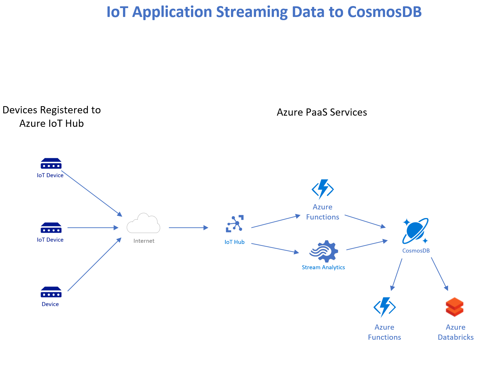
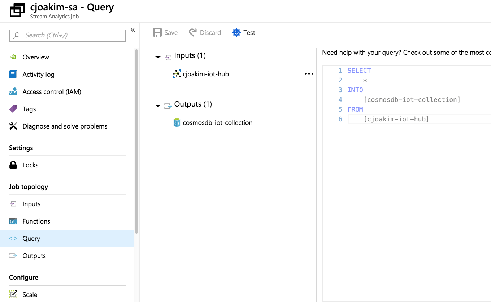

# azure-cosmosdb-iot

An implementation of an IoT streaming data pipeline using the following Azure PaaS services:
- Azure IoT Hub
- Azure Stream Analytics
- Azure CosmosDB with SQL API
- Simulated IoT devices implemented in Node.js.

---



---

## Links

- https://azure.microsoft.com/en-us/services/iot-hub/
- https://azure.microsoft.com/en-us/services/stream-analytics/
- https://docs.microsoft.com/en-us/azure/cosmos-db/introduction
- https://docs.microsoft.com/en-us/azure/iot-hub/quickstart-send-telemetry-node

---

## Provision Azure Resources

### Provision an IoT Hub PaaS Service

Name: cjoakim-iot-hub
Hostname: cjoakim-iot-hub.azure-devices.net
Pricing and scale tier: S1 - Standard


### Provision a Stream Analytics PaaS Service


### Provision a CosmosDB PaaS Service

Create an Azure CosmosDB with the SQL API (i.e. - DocumentDB).


Then create the **iot** collection in the **dev** database.  
Specify **unlimited storage capacity**, a **partition key** named **/pk**,
and a **throughput of 10,000 RUs**.


---

## Register Simulated Devices with the Azure CLI

Verify that you have a recent version of the **az CLI program**:
```
$ az --version
azure-cli (2.0.44)
...
```

Add the az extension for IoT, add two simulated devices, and get their connection-strings:
```
$ az extension add --name azure-cli-iot-ext

$ az iot hub device-identity create --hub-name cjoakim-iot-hub --device-id cjoakim-device1
$ az iot hub device-identity show-connection-string --hub-name cjoakim-iot-hub --device-id cjoakim-device1 --output json

$ az iot hub device-identity create --hub-name cjoakim-iot-hub --device-id cjoakim-device2
$ az iot hub device-identity show-connection-string --hub-name cjoakim-iot-hub --device-id cjoakim-device2 --output json
```

Visit Azure Portal, and see that the new devices are listed:


---

## Implement the Stream Analytics Job

See https://docs.microsoft.com/en-us/azure/stream-analytics/stream-analytics-manage-job

- Consume the IoT Hub datastream
- Code in SQL-like syntax and JavaScript UDFs (User Defined Functions)
- Optionally integrate with the AML Predictive Web Service

First, register your IoT Hub as an Input.

Next, register your CosmosDB as an Output, specify database **dev** and collection **iot**.

Next, implement the **query syntax** for your job, for example:
 


It's as simple as 6-lines of SQL-like code!

Finally, Start the Stream Analytics Job

---

## Send Events to the IoT Hub

First, install the Node.js NPM libraries:
```
$ npm install
```

Next, send 1000 messages, pausing 250 milliseconds between messages.
```
node simulated_device.js device1 250 1000 send
```

The devices send JSON data that looks like the following.
Note the [GeoJSON](http://geojson.org) with the current GPS coordinates of the device.
```
{
  "pk": "device1",
  "device": "device1",
  "seq": 2039,
  "date": "2018-08-29T19:25:01.204Z",
  "epoch": 1535570701204,
  "temperature": 20.933610735073643,
  "humidity": 62.25249468998116,
  "location": {
    "type": "Point",
    "coordinates": [
      -122.67585039138794,
      45.51607553847134
    ]
  },
  "dist_meters": "42638.30859375",
  "alt_meters": "14.600000381469727"
}
```

---

## Query the IoT data in CosmosDB

The query syntax is SQL-like:
```
Count the documents in the collection:
SELECT COUNT(1) FROM c

Most recent document:
SELECT TOP 1 * FROM c order by c.epoch desc

SELECT * FROM c WHERE c.pk = 'device1' and c.seq = 2039 order by c.epoch desc
```

Spatial Query with GPS coordinates (Events with 10-meters of the PDX marathon start and finish lines):
```
SELECT * FROM root WHERE ST_DISTANCE(root.location, {'type': 'Point', 'coordinates': [-122.67587503418326, 45.516625475138426] }) < 10

SELECT * FROM root WHERE ST_DISTANCE(root.location, {'type': 'Point', 'coordinates': [-122.67585039138794, 45.51607553847134] }) < 10
```

The documents in CosmosDB now look like this.  Note that both the IoT Hub and CosmosDB augmented
the JSON data sent by the device.
```
{
    "pk": "device1",
    "device": "device1",
    "seq": 2039,
    "date": "2018-08-29T19:25:01.204Z",
    "epoch": 1535570701204,
    "temperature": 20.933610735073643,
    "humidity": 62.25249468998116,
    "location": {
        "type": "Point",
        "coordinates": [
            -122.67585039138794,
            45.51607553847134
        ]
    },
    "dist_meters": "42638.30859375",
    "alt_meters": "14.600000381469727",
    "EventProcessedUtcTime": "2018-08-29T19:25:01.2780689Z",
    "PartitionId": 0,
    "EventEnqueuedUtcTime": "2018-08-29T19:25:01.217Z",
    "IoTHub": {
        "MessageId": null,
        "CorrelationId": null,
        "ConnectionDeviceId": "cjoakim-device1",
        "ConnectionDeviceGenerationId": "636710684711586771",
        "EnqueuedTime": "2018-08-29T19:25:01.221Z",
        "StreamId": null
    },
    "id": "fdf6d536-dbf2-c8af-b92d-10b729db8c26",
    "_rid": "VAtpAJ2a-t73BwAAAAAADA==",
    "_self": "dbs/VAtpAA==/colls/VAtpAJ2a-t4=/docs/VAtpAJ2a-t73BwAAAAAADA==/",
    "_etag": "\"5e00c5c6-0000-0000-0000-5b86f3120000\"",
    "_attachments": "attachments/",
    "_ts": 1535570706
}
```
---

## CosmosDB easily integrates with other Azure PaaS services

- Azure Functions, event-driven serverless code, see https://docs.microsoft.com/en-us/azure/azure-functions/ 
- Azure Databricks, Apache Spark-based analytics platform, see https://docs.microsoft.com/en-us/azure/azure-databricks/what-is-azure-databricks


